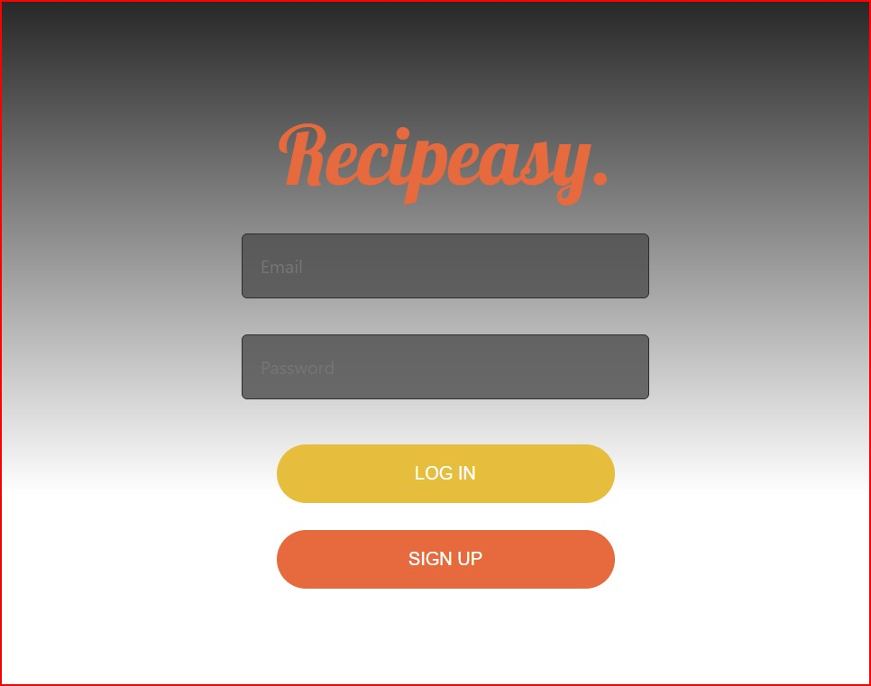
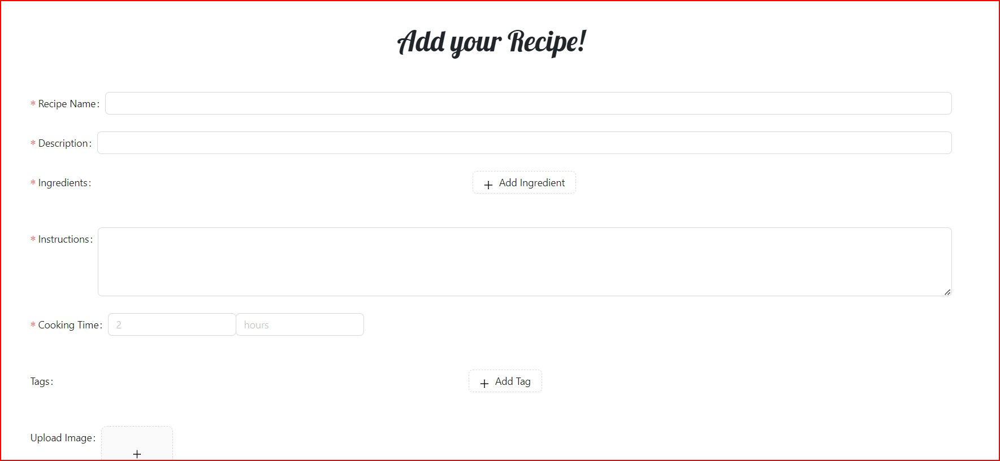

# 🍲 Recipeasy

## Description

Recipeasy is a recipe app that allows users to search, save, and share recipes. Users can also create their own recipes and add them to the database.

## Table of Contents

- [Getting Started](#getting-started)
- [Usage](#usage)
- [Built With](#built-with)
- [License](#license)
- [Acknowledgements](#acknowledgements)
- [Screenshots](#screenshots)
- [Links](#links)
- [Questions](#questions)
- [Contributors](#contributors)

## 🚀 Getting Started

This is a fully deployed app on Heorku. You can access the app here: [Recipeasy](https://recipeasy-app.herokuapp.com/)

## 📖 Usage

Signup or login to the app. Once logged in, you can search for recipes by name or by ingredients. You can also create your own recipes and add them to the database.

## 🛠️ Built With

- [Node.js](https://nodejs.org/en/)
- [Express.js](https://expressjs.com/)
- [Apollo Server](https://www.apollographql.com/docs/apollo-server/)
- [GraphQL](https://graphql.org/)
- [MongoDB](https://www.mongodb.com/)
- [Mongoose](https://mongoosejs.com/)
- [React](https://reactjs.org/)
- [Ant Design](https://ant.design/)
- [JWT](https://jwt.io/)
- [Bcrypt](https://www.npmjs.com/package/bcrypt)
- [Heroku](https://www.heroku.com/)
- [Context API](https://reactjs.org/docs/context.html)
- [React Router](https://reactrouter.com/)
- [IndexedDB](https://developer.mozilla.org/en-US/docs/Web/API/IndexedDB_API)

## 📜 License

This project is licensed under the MIT License.

## 🙏 Acknowledgements

- [React Documentation](https://reactjs.org/docs/getting-started.html)
- [Ant Design Documentation](https://ant.design/docs/react/introduce)
- [IndexedDB Documentation](https://developer.mozilla.org/en-US/docs/Web/API/IndexedDB_API)
- [Create React App Documentation](https://create-react-app.dev/docs/getting-started/)

## 📸 Screenshots

## 🔗 Links

- [Deployed App](https://recipeasy-cookbook.herokuapp.com/)
- [GitHub Repo](https://github.com/cjmugs1/recipeasy/)

## ❓ Questions

If you have any questions about the repo, open an issue or contact any of this contributors to the project below.

## 👥 Contributors
Christopher Dean - [GitHub](github.com/coderchrisdean)
Connor Mulligan - [GitHub](github.com/cjmugs1)
Daniel Willett - [GitHub](github.com/danwillett)
Marissa Thompson - [GitHub](github.com/*****)
Winston Heard - [GitHub](github.com/*****)
